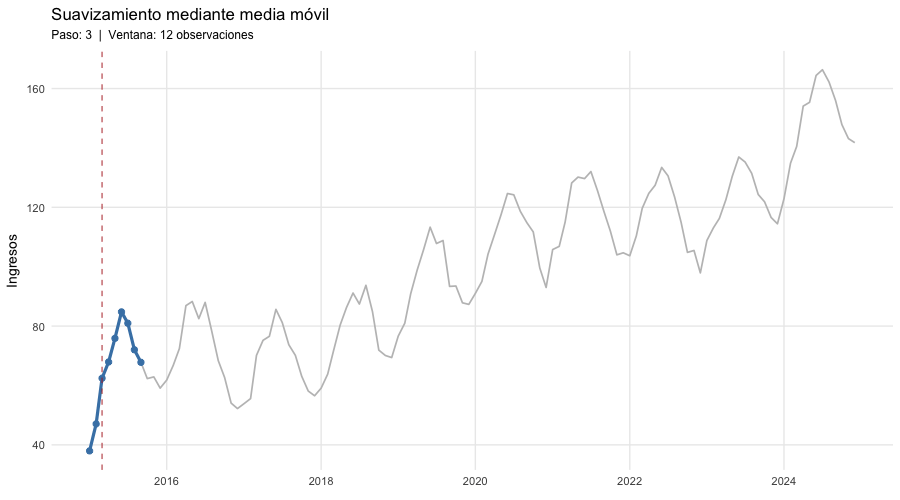

```{r setup, include=FALSE}

knitr::opts_chunk$set(
	error = F,
	fig.align = "center",
	fig.cap = " ",
	fig.dim = c(8, 6),
	message = FALSE,
	warning = FALSE,
	echo = F,
	fig.pos="H")

#Limpiamos entorno
rm(list = ls(all.names = TRUE))
gc() #Liberamos memoria

```


```{r libs, include=FALSE}
library(tidyverse)
library(plotly)
library(gganimate)
library(forecast)
library(zoo)
library(mFilter)
library(patchwork)
library(ggplot2)
library(kableExtra)


tabKable <- function(tabla,cap=""){
  tabla %>% 
    kbl(booktabs = TRUE, align = "c",caption = cap) %>%
    #Evitamos que cambie de posición 
    kable_styling(latex_options = c("hold_position")) 
}  


```


# 1. Componentes gráficos de una serie de tiempo

Una serie de tiempo puede descomponerse (de forma aditiva) como:


$$ 
Y_t = m_t + s_t + C_t + \varepsilon_t 
$$

donde:

- **Tendencia ($m_t$):** Movimiento a largo plazo, suave y sostenido (creciente, decreciente o estable).

- **Estacionalidad ($s_t$):** patrón que se repite con **periodicidad fija y conocida**, generalmente ligada al calendario (mensual, trimestral, día de la semana). Su período no cambia con el tiempo.

- **Ciclicidad ($C_t$) (Usualmente se omite):** oscilaciones de subida y bajada **sin período fijo**, normalmente más largas que la estacionalidad (varios años), asociadas a fenómenos como ciclos económicos, crediticios o de negocio. A diferencia de la estacionalidad, su duración y amplitud varían de un ciclo a otro.

- **Ruido/Error ($\varepsilon_t$):** Variación residual aleatoria no explicada por los componentes anteriores.


# 2. Ingresos mensuales de un comercio en la playa

Supongamos que nos interesa analizar los ingresos mensuales (en miles de pesos) de un destino turístico de playa entre 2015 y 2024. Nuestra serie será construida artificialmente con el objetivo de ilustrar algunas ideas.

- La tendencia será lineal y creciente, dada por la ecuación $m_t = 50 + 0.8t$ (en miles de pesos).
- La estacionalidad será sinusoidal con amplitud de 15 mil pesos y período de 12 meses, representando la temporada alta y baja del turismo.
- La ciclicidad será una combinación de dos ondas sinusoidales con períodos de 54 y 37 meses, representando ciclos económicos globales.
- El ruido será generado a partir de una distribución normal con media cero y desviación estándar de 3 mil pesos.

Además la serie de ingresos mensuales tendrá la descomposición aditiva:

$$
Y_t = m_t + s_t + C_t + \varepsilon_t
$$


```{r construir-serie, echo=TRUE}
set.seed(2026)

n <- 120  # 10 años de datos mensuales
t <- 1:n
fechas <- seq(as.Date("2015-01-01"), by = "month", length.out = n)

tendencia <- 50 + 0.8 * t

estacionalidad <- 15 * sin(2 * pi * (t - 3) / 12)

ciclo <- 10 * sin(2 * pi * t / 54) + 4 * sin(2 * pi * t / 37)

ruido <- rnorm(n, mean = 0, sd = 3)

ingresos <- tendencia + estacionalidad + ciclo + ruido

serie_df <- tibble(
  fecha = fechas,
  ingresos = ingresos,
  tendencia = tendencia,
  estacionalidad = estacionalidad,
  ciclo = ciclo
)

head(serie_df, 12)
```

\\

## Visualización de la serie completa con `plotly`

No es ninguna sospresa que al visualizar la serie, podemos identificar los componentes de tendencia y estacionalidad, el componente cíclico es más difícil de identificar a simple vista.

```{r plot-serie}
plot_ly(serie_df, x = ~fecha) %>%
  add_lines(y = ~ingresos, name = "ingresos observados",
            line = list(color = "steelblue")) %>%
  layout(
    title = "Ingresos mensuales a destino turístico  (2015-2024)",
    xaxis = list(title = "Fecha", rangeslider = list(visible = FALSE)),
    yaxis = list(title = "Miles de ingresos"),
    legend = list(orientation = "h", y = -0.2)
  )
```

\\

Una interpretación de cada componente en el contexto turístico podría ser la siguiente:

- **Tendencia:** El destino gana popularidad año con año (publicidad, inversión en infraestructura hotelera).

- **Estacionalidad:** Cada año hay temporada alta (vacaciones de invierno/verano) y temporada baja (temporada de huracanes), con un patrón que se repite cada 12 meses.

- **Ciclicidad:** El turismo internacional responde a factores económicos, políticos y socialesque duran varios años y no tienen una duración fija.

Una vez que hemos identificado los componentes, podemos estimarlos y analizarlos por separado para entender mejor el comportamiento de la serie.


## Estimando la tendencia

Hay diversas forma de estimar la tendencia de una serie de tiempo cuando hay presencia de estacionalidad. Una de las más simples es mediante un  **filtro de Medias Móviles**, otro método es mediante **regresión lineal simple o Mínimos Cuadrados Ordinarios** y finalmente podemos utilizar una **regresión polinómica** para capturar una ligera curvatura en la tendencia, también existe el método de **suavizamiento exponencial**.


### Filtro de Medias Móviles

La idea de este método es tomar ventanas de tiempo con radio $q$ y calcular el promedio de cada ventana. 

$$
w_t = \frac{1}{2q + 1} \sum_{j=-q}^{q} Y_{t+j} \quad t = q+1, \ldots, n-q
$$

En R, se puede implementar con la función `rollmean()` del paquete `zoo`. A continuación se muestra un ejemplo de cómo se calcula la media móvil centrada con ventana de 12 meses (radio de 6). El punto rojo representa el valor $w_t$ calculado respecto a la ventana centrada en $X_t$.


```{r mm_animacion, eval=FALSE}

# Media movil radio 6
m <- 12

serie_df <- serie_df |>
  mutate(
    media_movil = zoo::rollmean(
      ingresos,
      k = m,
      fill = NA,
      align = "center"
    )
  )

#ventanas
pasos <- 3:(n - 2)
anim_df <- map_dfr(pasos, function(i) {

  inicio <- i - floor(m / 2)
  fin <- i + floor(m / 2)

  serie_df |>
    mutate(
      paso = i,
      dentro_ventana = row_number() >= inicio &
        row_number() <= fin,
      punto_mm = row_number() == i
    )
})


p <- ggplot() +
  # Serie original
  geom_line(
    data = serie_df,
    aes(fecha, ingresos),
    color = "grey75",
    linewidth = 0.8
  ) +

  # Ventana móvil
  geom_line(
    data = anim_df |>
      filter(dentro_ventana),
    aes(fecha, ingresos),
    color = "steelblue",
    linewidth = 1.5
  ) +

  # Observaciones de la ventana
  geom_point(
    data = anim_df |>
      filter(dentro_ventana),
    aes(fecha, ingresos),
    color = "steelblue",
    size = 2.5
  ) +

  # Media móvil
  geom_point(
    data = anim_df |>
      filter(punto_mm),
    aes(fecha, media_movil),
    color = "firebrick",
    size = 5
  ) +

  # Línea que marca el centro
  geom_vline(
    data = anim_df |>
      filter(punto_mm),
    aes(xintercept = as.numeric(fecha)),
    color = "firebrick",
    linetype = "dashed",
    alpha = 0.7
  ) +

  labs(
    title = "Suavizamiento mediante media móvil",
    subtitle = paste0(
      "Paso: {frame_time}  |  Ventana: ",
      m, " observaciones"
    ),
    x = NULL,
    y = "Ingresos"
  ) +

  theme_minimal(base_size = 14) +

  theme(
    panel.grid.minor = element_blank(),
    plot.title = element_text(face = "bold"),
    plot.subtitle = element_text(size = 12)
  ) +

  transition_time(paso) +

  ease_aes("linear")

#crea animacion
animacion <- animate(
  p,
  nframes = 60,
  fps = 5,
  width = 900,
  height = 500,
  renderer = gifski_renderer()
)
#guarda como gif
animacion
anim_save(
  "media_movil.gif",
  animation = animacion
)
```





La fórmula anterior no está definida para los primeros y últimos $q$ puntos de la serie, se puede optar por mantener constante el valor de la media móvil en los extremos, o dejarlo como NA. 


### Suavizamiento exponencial

Este método es una alternativa a la media móvil, que asigna pesos decrecientes a las observaciones más antiguas. La fórmula para el suavizamiento exponencial simple es:


### MCO 

La estimación de la tendencia mediante Minimos Cuadrados Ordinarios (MCO) consiste en suponer una ecuación paramétrica para la tendencia (por ejemplo, lineal o polinómica) y optimizar los parámetros para la función objetivo:

$$
L(a_0, a_1, \ldots, a_p) = \sum_{t=1}^{n} (Y_t - a_0 - a_1 t - \ldots - a_p t^p)^2
$$

Lo anterior es equivalente a ajustar un modelo de regresión lineal o polinómica, donde la variable dependiente es la serie de tiempo y la variable independiente es el tiempo (o sus potencias). En R, se puede implementar con la función `lm()`.


### Comparativa

Ya que tenemos varios métodos, es de utilidad complementar la comparativa con métricas de evaluación como el RMSE y el MAE para determinar cuál de los métodos es más adecuado para estimar la tendencia de la serie.

```{r comparativa-metodos-tendencia, fig.dim=c(8,8)}

## a) Media móvil centrada (ventana de 12 meses, filtro simple)
serie_df$mm_12 <- rollmean(ingresos, k = 12, fill = NA, align = "center")
 
## b) Regresión lineal simple: ingresos ~ t
mod_lineal <- lm(ingresos ~ t, data = serie_df)
serie_df$tend_lineal <- predict(mod_lineal)
 
## c) Regresión polinómica (grado 3) para capturar ligera curvatura
mod_poly <- lm(ingresos ~ poly(t, 3), data = serie_df)
serie_df$tend_poly <- predict(mod_poly)
 
metodos <- c("mm_12", "tend_lineal", "tend_poly")
 
rmse <- function(estimado, real) sqrt(mean((estimado - real)^2, na.rm = TRUE))
mae  <- function(estimado, real) mean(abs(estimado - real), na.rm = TRUE)
 
tabla_errores <- tibble(
  metodo = metodos,
  RMSE = map_dbl(metodos, ~ rmse(serie_df[[.x]], serie_df$tendencia)),
  MAE  = map_dbl(metodos, ~ mae(serie_df[[.x]], serie_df$tendencia))
) %>% arrange(RMSE) 
 
print(tabla_errores)


tabKable(tabla_errores, cap = "Comparativa de métodos de estimación de tendencia mediante RMSE y MAE")

```

\\


```{r comparativa-metodos-tendencia-plot}
colores <- c(
  "Ingresos observados"        = "#d3d3d38f",
  "Tendencia real (simulada)"  = "black",
  "Media móvil (12m)"          = "steelblue",
  "Regresión lineal"           = "firebrick",
  "Regresión polinómica (g3)"  = "darkorange"
)
 
fig <- plot_ly(serie_df, x = ~fecha) %>%
  add_lines(y = ~ingresos, name = "Ingresos observados",
            line = list(color = colores["Ingresos observados"], width = 2)) %>%
  add_lines(y = ~tendencia, name = "Tendencia real (simulada)",
            line = list(color = colores["Tendencia real (simulada)"], width = 3, dash = "dot")) %>%
  add_lines(y = ~mm_12, name = "Media móvil (12m)",
            line = list(color = colores["Media móvil (12m)"], width = 2)) %>%
  add_lines(y = ~tend_lineal, name = "Regresión lineal",
            line = list(color = colores["Regresión lineal"], width = 2)) %>%
  add_lines(y = ~tend_poly, name = "Regresión polinómica (g3)",
            line = list(color = colores["Regresión polinómica (g3)"], width = 2)) %>%
  layout(
    title = "Comparación de métodos de estimación de tendencia",
    xaxis = list(title = "Fecha", rangeslider = list(visible = FALSE)),
    yaxis = list(title = "Ingresos"),
    legend = list(orientation = "h", y = -0.25),
    hovermode = "x unified"
  )
 
fig
```


```{r plot-tendencia}

plot_ly(serie_df, x = ~fecha) %>%
  add_lines(y = ~ingresos, name = "ingresos observados",
            line = list(color = "steelblue")) %>%
  add_lines(y = ~tendencia, name = "Tendencia",
            line = list(color = "firebrick", width = 3)) %>%
  layout(
    title = "Tendencia real (construida)",
    xaxis = list(title = "Fecha", rangeslider = list(visible = FALSE)),
    yaxis = list(title = "Miles de ingresos"),
    legend = list(orientation = "h", y = -0.2)
  )

```


\\

## Estacionalidad vs Ciclicidad

```{r plot-componentes}
plot_ly(serie_df, x = ~fecha) %>%
  add_lines(y = ~estacionalidad, name = "Estacionalidad (período fijo = 12 meses)",
            line = list(color = "darkgreen")) %>%
  add_lines(y = ~ciclo, name = "Ciclicidad (período variable, varios años)",
            line = list(color = "purple")) %>%
  layout(
    title = "Componentes de estacionalidad y ciclicidad",
    xaxis = list(title = "Fecha", rangeslider = list(visible = FALSE)),
    yaxis = list(title = "Valor"),
    legend = list(orientation = "h", y = -0.2)
  )
```

\\

## Interpretación de cada componente en el contexto


**Tendencia:**

La línea de tendencia pasa de ~50 mil ingresos/mes en 2015 a ~146 mil ingresos/mes en 2024, un crecimiento sostenido de aproximadamente 0.8 mil ingresos adicionales cada mes. 

En el contexto turístico, esto refleja el posicionamiento progresivo del destino: más conectividad aérea, mayor inversión hotelera y mejor reputación internacional, todo lo cual empuja la demanda al alza año tras año, independientemente del mes en que estemos.

**Estacionalidad:**

El patrón oscila con amplitud de ±15 mil ingresos y se repite **exactamente cada 12 meses**: los picos coinciden con la temporada alta (vacaciones de invierno, cuando turistas de climas fríos buscan sol y playa) y los valles con la temporada de huracanes (baja demanda por riesgo climático). 

Este comportamiento es predecible: un operador turístico puede anticipar con certeza en qué meses necesitará más personal y en cuáles deberá ofrecer promociones.

**Ciclicidad:**

A diferencia de la estacionalidad, el componente cíclico tiene una duración que ronda entre 3 y 4.5 años y **no coincide con ningún mes del calendario en particular**. 

Representa cómo el gasto turístico internacional se expande en períodos de bonanza económica global y se contrae en períodos de desaceleración o crisis (por ejemplo, recesiones, crisis cambiarias en los países emisores de turistas). 

A diferencia de la estacionalidad, este componente es mucho más difícil de anticipar con precisión porque su duración y amplitud cambian de un ciclo a otro.


# 3. Procesos estocásticos estacionarios

Un proceso $\{Y_t\}$ es **débilmente (o de segundo orden) estacionario** si cumple:

1. $E[Y_t] = \mu$ (media constante, no depende de $t$)
2. $Var(Y_t) = \sigma^2$ (varianza constante y finita)
3. $Cov(Y_t, Y_{t+k})$ depende únicamente del rezago $k$, no del tiempo $t$


## Ruido blanco 

Definimos un **ruido blanco** como una colección de variables aleatorias identicamente distribuidas con media cero y varianza $\sigma^2$, que además $cov(e_t, e_{k}) = \sigma^2$ si $t=k$ y $cov(e_t, e_{k}) = 0$ en otro caso. Hay que notar que no se está especificando la distribución y tampoco si las variables son independientes, solo que no hay correlación entre ellas. 
En general, correlación cero no implica independencia, pero si las variables son independientes entonces sí hay correlación cero.

## Ejemplo 1: Ruido blanco **gaussiano**

La colección de variables aleatorias $e_1,...,e_n$  de variables independientes e identicamente distribuidas pertenecientes a la distribución $N(0,\sigma^{2})$ es un ruido blanco gaussiano. En este caso, es muy fácil notar que se trata de un proceso estacionario.
Un proceso con esta característica nos permitirá modelar fenómenos más complejos.

```{r ruido-blanco}
set.seed(1)
n2 <- 200
fechas2 <- seq(as.Date("2020-01-01"), by = "day", length.out = n2)

ruido_blanco <- rnorm(n2, mean = 0, sd = 1)
df_wn <- tibble(fecha = fechas2, valor = ruido_blanco)

plot_ly(df_wn, x = ~fecha, y = ~valor, type = "scatter", mode = "lines",
        line = list(color = "gray30")) %>%
  layout(
    title = "Ruido blanco gaussiano",
    xaxis = list(title = "Fecha", rangeslider = list(visible = FALSE)),
    yaxis = list(title = "Valor")
  )
```


## Ejemplo 2: Proceso AR(1) estacionario (|phi| < 1)

El modelo Autoregresivo de orden uno definido como:

$$
Y_t = 0.7 * Y_{(t-1)} + e_t
$$

Donde $e_1,...,e_n$ es una muestra aleatoria de la distribución $N(0,1)$

```{r ar1}
set.seed(42)
ar1_sim <- arima.sim(model = list(ar = 0.7), n = n2)
df_ar1_ts <- tibble(fecha = fechas2, valor = as.numeric(ar1_sim))

plot_ly(df_ar1_ts, x = ~fecha, y = ~valor, type = "scatter", mode = "lines",
        line = list(color = "steelblue")) %>%
  layout(
    title = "Proceso AR(1)",
    xaxis = list(title = "Fecha", rangeslider = list(visible = FALSE)),
    yaxis = list(title = "Valor")
  )
```

```{r ar1-acf, fig.width=7, fig.height=4}
ggAcf(ar1_sim) +
  labs(title = "ACF de un proceso AR(1) con phi = 0.7") +
  theme_minimal(base_size = 13)
```

## Ejemplo 3: Caminata aleatoria gaussiana (sin tendencia)

La caminata aleatoria gaussiana es un proceso estocástico definido como:

$$
Y_t = Y_{(t-1)} + e_t = \sum_{i=1}^{t} e_i
$$

Donde $e_1,...,e_n$ es una muestra aleatoria de la distribución $N(0,1)$ y $Y_0 = 0$. En este caso, la varianza crece con el tiempo y no existe un nivel fijo al cual la serie "regrese", por lo que **no** es estacionaria.

En el caso con tendencia resulta casi inmediato notar que la serie no es estacionaria, por el término $\delta t$.


```{r random-walk}
set.seed(42)
caminata_aleatoria <- cumsum(rnorm(n2)) 
df_rw <- tibble(fecha = fechas2, valor = caminata_aleatoria)

plot_ly(df_rw, x = ~fecha, y = ~valor, type = "scatter", mode = "lines",
        line = list(color = "firebrick")) %>%
  layout(
    title = "Caminata aleatoria gaussiana",
    xaxis = list(title = "Fecha", rangeslider = list(visible = FALSE)),
    yaxis = list(title = "Valor")
  )
```


# 5. Animación de un proceso estocástico con `gganimate`

```{r anim-ar1,eval=FALSE}
df_ar1 <- tibble(t = 1:n2, valor = as.numeric(ar1_sim))

p_anim <- ggplot(df_ar1, aes(t, valor)) +
  geom_line(color = "steelblue", linewidth = 0.9) +
  geom_point(color = "steelblue", size = 1.6) +
  geom_hline(yintercept = 0, linetype = "dashed", color = "gray40") +
  labs(
    title = "Realización de un proceso AR(1) estacionario (phi = 0.7)",
    subtitle = "t = {frame_along}",
    x = "Tiempo", y = "Valor"
  ) +
  theme_minimal(base_size = 13) +
  transition_reveal(along =  t)
```

## Estacionario vs No Estacionario

```{r anim-comparacion,eval=FALSE}
df_comparacion <- bind_rows(
  df_ar1 %>% mutate(proceso = "AR(1) estacionario (phi = 0.7)"),
  tibble(t = 1:n2, valor = caminata_aleatoria, proceso = "Caminata aleatoria (NO estacionaria)")
)

p_comp <- ggplot(df_comparacion, aes(t, valor, color = proceso)) +
  geom_line(linewidth = 0.9) +
  facet_wrap(~proceso, scales = "free_y", ncol = 1) +
  labs(
    title = "Estacionario vs. no estacionario",
    subtitle = "t = {frame_along}",
    x = "Tiempo", y = "Valor"
  ) +
  theme_minimal(base_size = 13) +
  theme(legend.position = "none") +
  transition_reveal(along = t)

```

